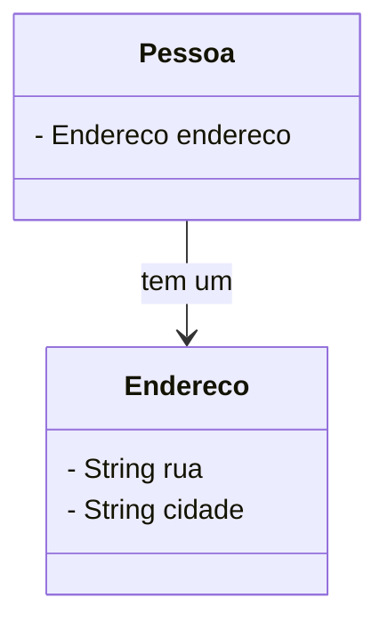
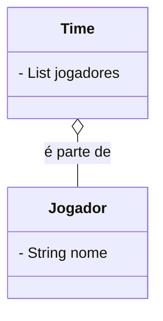
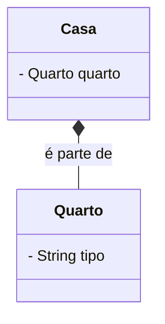
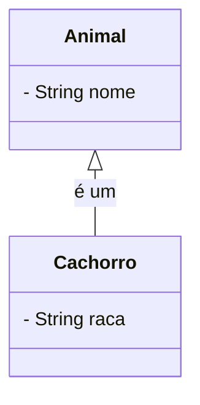
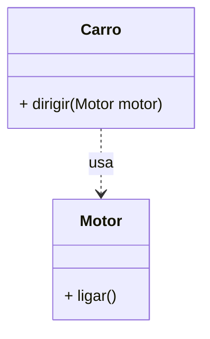
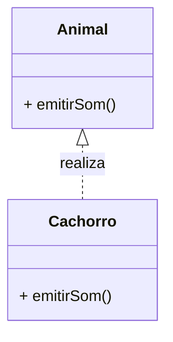
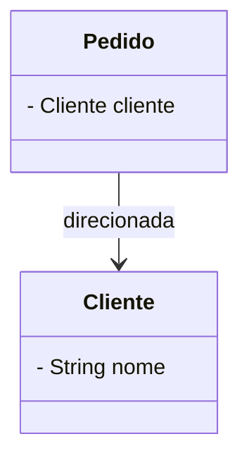
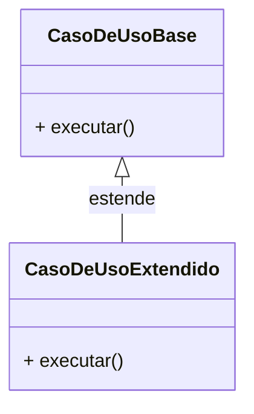
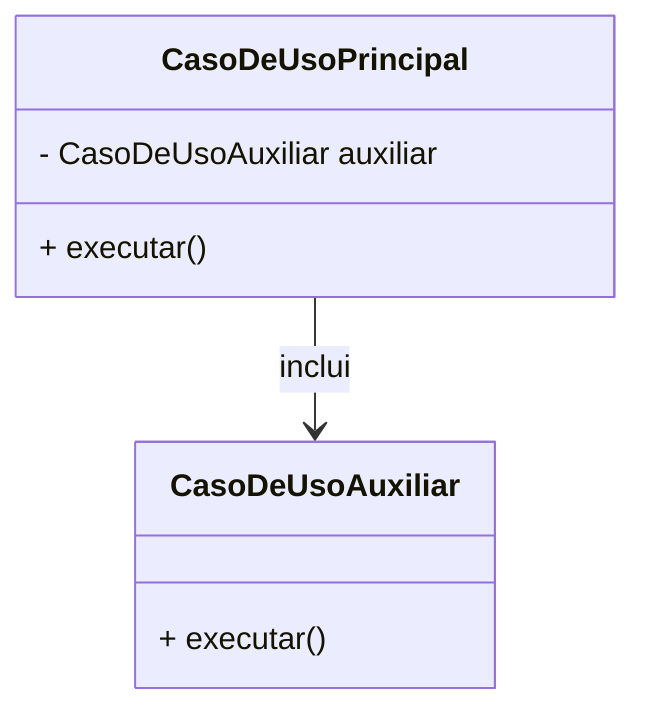

# Relacionamentos em Programação

## Associação
Relacionamento estrutural do tipo **TEM-UM**

## Agregação
Relação **É PARTE DE**, os objetos podem existir independentemente.

## Composição
Relação **É PARTE DE**, os objetos não podem existir independentemente.

## Herança
Representa uma relação **É-UM**.

## Dependência
Representa uma relação **USA**.

## Realização
Representa a implementação de um contrato (**interface**).

## Associação Direcionada

Representa uma associação navegável em **apenas uma direção**.

## Extensão
Representa um caso de uso que pode **estender** outro.

## Inclusão

Representa um caso de uso que **requer** outro.

