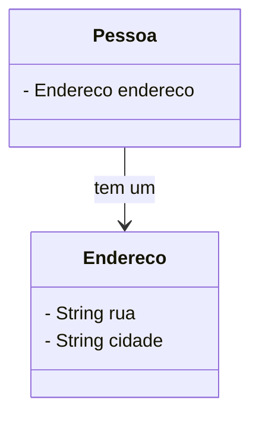
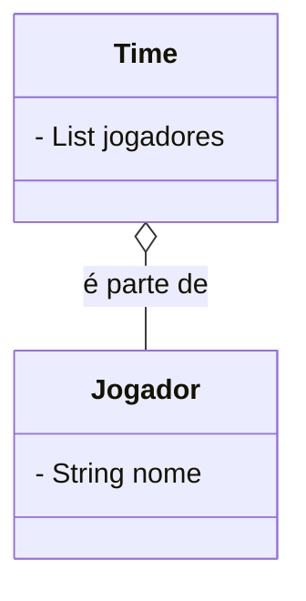

# Relacionamentos em Programação

## Associação
Relacionamento estrutural do tipo **TEM-UM**

```mermaid
classDiagram
Pessoa --> Endereco : tem um
class Pessoa {
- Endereco endereco
  }
  class Endereco {
- String rua
- String cidade
  }
```

## Agregação
Relação **É PARTE DE**, os objetos podem existir independentemente.

```mermaid
classDiagram
Time o-- Jogador : é parte de
class Time {
  - List<Jogador> jogadores
}
class Jogador {
  - String nome
}
```